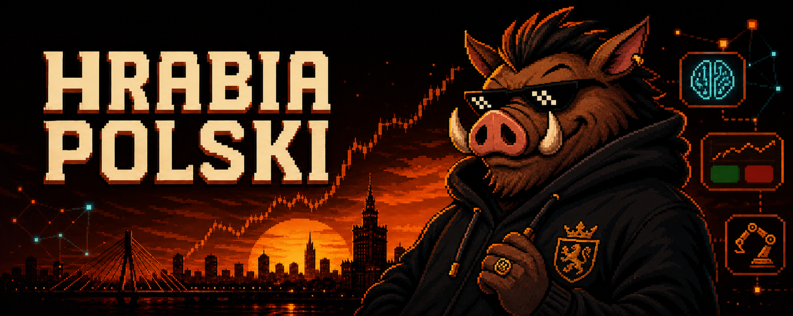

<div align="center">



**AI agents · Prediction markets · Automation · Self-hosted systems**

[](https://x.com/hrabiapolski)
[](https://t.me/hrabiaPolski)
[](https://github.com/hrabiapolski)

</div>

### I turn noise into systems.

I'm **Hrabia** — a builder exploring the edge where artificial intelligence meets markets.

I create agents that research, workflows that run themselves, and tools that turn streams of data into decisions.

```text
RESEARCH  →  SIGNAL  →  DECISION  →  AUTOMATION
```

```text
🧠 AI agents          research · monitoring · tool use
📈 Prediction markets probability · mispricing · execution
⚙️ Automation         APIs · data pipelines · n8n
🛰️ Infrastructure     Linux · Docker · self-hosting
```

## Inside the lab

**PolyEdge** — prediction-market analytics and arbitrage infrastructure.  
Monitoring probabilities, finding price discrepancies, turning market data into actionable signals.

**Agent Router** — model-routing infrastructure for AI agents.  
Choosing the right model for each task by capability, speed, and cost.

**AI Content Engine** — an automated research-to-publishing workflow.  
Finding ideas, collecting context, drafting posts, and distributing content across platforms.

**Self-Hosted Stack** — private infrastructure I control.  
Linux services, Docker containers, networking, VPNs, and automation running on my own terms.

## Shipped

[**funpay-cardinal-fragment-stars**](https://github.com/hrabiapolski/funpay-cardinal-fragment-stars)  
Automated Telegram Stars delivery through Fragment for FunPayCardinal.

## Toolkit

<p>
  
  
  
  
  
  
  
</p>

## Operating principles

> Build small systems. Follow the data. Automate the repetitive. Own the infrastructure. Ship fast.

I care less about collecting tools and more about building things that create **leverage**.

## Activity

<div align="center">


</div>

<div align="center">

**Building in public from the intersection of AI, markets, and automation.**

[Telegram](https://t.me/hrabiaPolski) · [X](https://x.com/hrabiapolski) · [LinkedIn](https://www.linkedin.com/in/hrabiapolski/)

</div>
